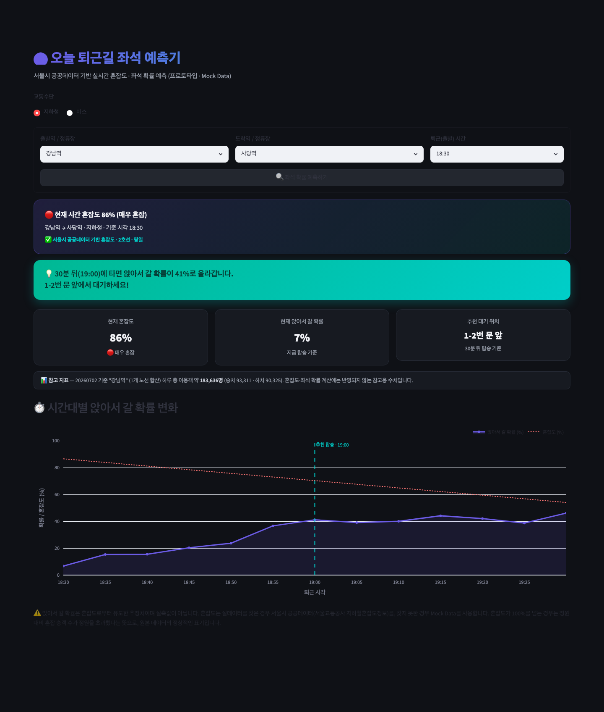
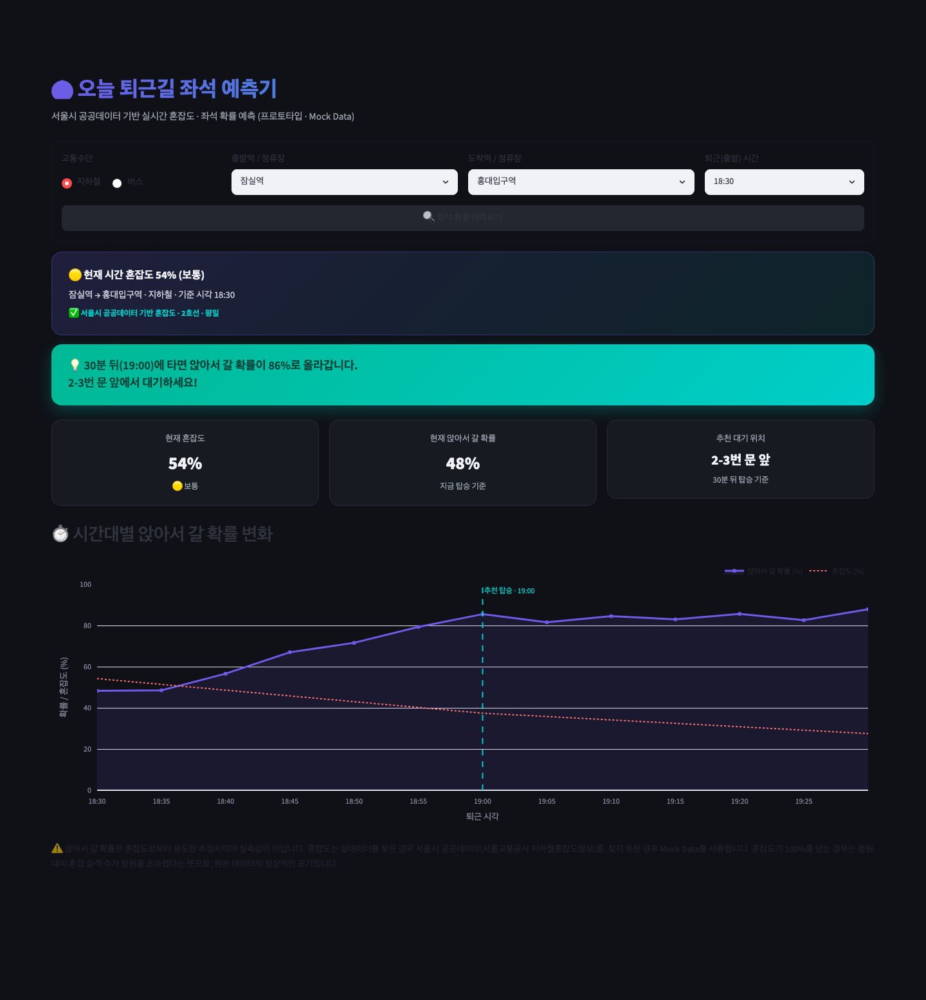
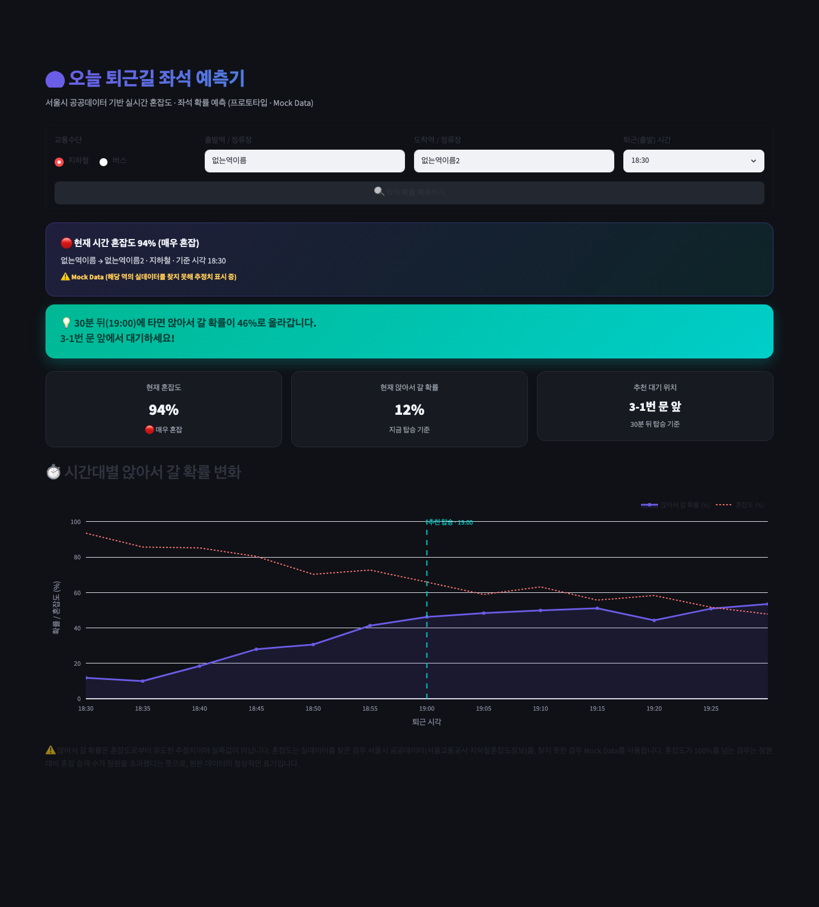
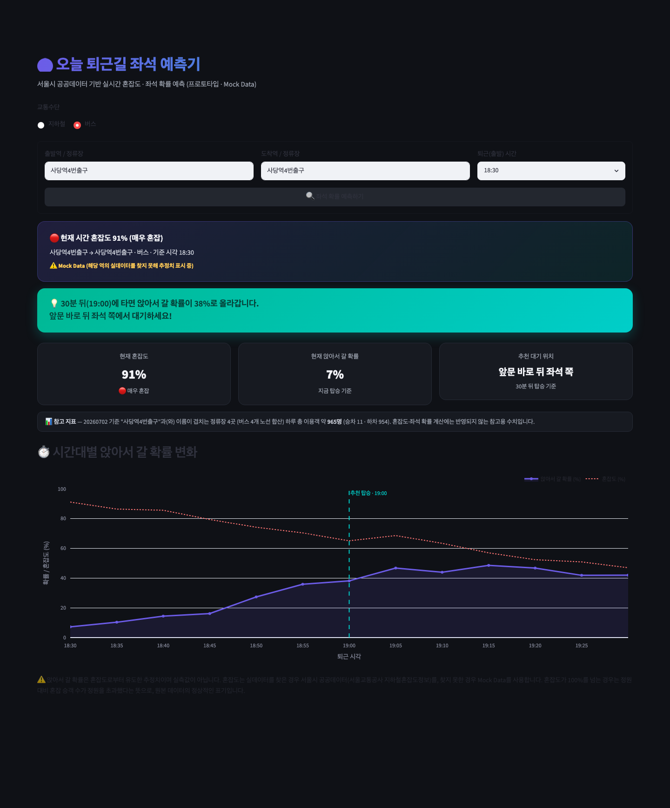

# 🚇 seat-predictor

직장인·대학생을 위한 **"오늘 퇴근/하교길 버스·지하철 좌석 예측기"**

서울시 공공데이터를 기반으로 출발지 → 도착지 구간의 혼잡도와 시간대별 좌석 확률을 예측하고,
"몇 분 뒤에 타면 앉아서 갈 수 있는지" 알려주는 대시보드입니다.
현재는 **Streamlit** 기반 프로토타입(MVP)이며, 지하철 혼잡도는 서울시 공공데이터
(서울교통공사 지하철혼잡도정보 Open API)를 실시간으로 연동하고, 매핑되지 않은
역/버스 데이터는 Mock Data로 대체됩니다. 지하철/버스 모드 모두 역·정류장의
하루 총 승하차 인원(서울시 지하철/버스 승하차 인원 정보)을 참고 지표로 함께
보여줍니다.

## 📸 스크린샷

|                                                    |                                                    |
| -------------------------------------------------- | -------------------------------------------------- |
| 지하철 · 강남역 → 사당역 · 18:30 (✅ 실데이터 · 2호선 + 참고 지표) | 역 이름 검색(selectbox) · 잠실역 → 홍대입구역 (✅ 실데이터) |
|  |  |
| 매핑되지 않은 역 → Mock Data 폴백 (⚠️ 배지 표시) | 버스 모드 · 정류장 하루 이용객 참고 지표 |
|  |  |

혼잡도가 실데이터로 확인된 경우 ✅ 배지와 함께 노선/기준 요일이 표시되고,
매핑에 없는 역이거나 API를 쓸 수 없는 경우 ⚠️ Mock Data 배지로 자동 전환됩니다.
혼잡도·좌석 확률 계산과는 무관하게, 지하철은 해당 역(전 노선 합산), 버스는
정류장 이름이 겹치는 정류장들의 하루 총 승하차 인원을 "📊 참고 지표"로 별도
표시합니다.

## 🚀 실행 방법

### 1. 가상환경 생성 및 활성화

```bash
python3 -m venv .venv

# macOS / Linux
source .venv/bin/activate

# Windows
.venv\Scripts\activate
```

### 2. 라이브러리 설치

```bash
pip install -r requirements.txt
```

### 3. (선택) 서울시 공공데이터 인증키 설정

지하철 혼잡도를 실데이터로 보거나 지하철/버스 참고 지표를 보려면 인증키가
필요합니다. 없어도 앱은 정상 동작하며, 이 경우 해당 값은 Mock Data로
표시되거나 참고 지표가 표시되지 않습니다.

1. https://data.seoul.go.kr 회원가입 후 로그인
2. [인증키 신청](https://data.seoul.go.kr/together/mypage/actkeyMain.do) — 즉시 무료 발급
   (지하철 혼잡도용, 지하철 승하차용, 버스 승하차용 각각 발급받아도 되고
   하나로 재사용해도 됩니다)
3. `.streamlit/secrets.toml.example`을 `.streamlit/secrets.toml`로 복사 후 발급받은 키를 입력
   (`secrets.toml`은 `.gitignore`에 등록되어 있어 커밋되지 않습니다)

```bash
cp .streamlit/secrets.toml.example .streamlit/secrets.toml
# .streamlit/secrets.toml을 열어 subway_congestion_key / subway_ridership_key /
# bus_ridership_key 값을 채워넣으세요
```

버스 참고 지표는 정류장당 필터 없이 하루 전체 데이터(약 4만여 건)를 받아와
캐싱하기 때문에, 버스 모드로 **처음** 조회할 때만 10~20초 정도 걸립니다.
이후 조회(같은 날짜 내)는 캐시에서 즉시 응답합니다. 지하철 참고 지표는
하루 전체가 618건 정도라 느리지 않습니다.

### 4. 앱 실행

```bash
streamlit run app.py
```

실행 후 브라우저에서 `http://localhost:8501` 로 접속하면 대시보드를 확인할 수 있습니다.

### 5. 모바일 데모 실행

수업 발표용 스마트폰 화면 데모는 별도 진입점으로 실행합니다.

```bash
streamlit run mobile_demo.py
```

팀원이 모바일 데모를 이어서 개발할 때는 `mobile-demo-base` 브랜치에서 새 기능
브랜치를 만들어 작업합니다. 자세한 협업 흐름은
[`docs/team-workflow.md`](docs/team-workflow.md)를 참고하세요.

## 🧱 프로젝트 구조

화면 코드와 로직 코드를 분리했습니다. 예측·데이터 로직은 프레임워크에 의존하지
않는 `core/` 패키지에 모으고, 발표용 데모(`app.py`, `mobile_demo.py`)는 이를
불러다 쓰기만 합니다. 이렇게 하면 앞으로 백엔드 API나 모바일 웹앱(PWA)이 같은
로직을 공유할 수 있습니다.

- `core/` — 공유 도메인 로직 (예측 엔진·서울 공공데이터 연동·캐시)
- `app.py` — 웹 프로토타입 데모 (유지)
- `mobile_demo.py` — 모바일 발표 데모 (유지)
- `seoul_api.py` — 기존 import 호환용 shim (`core.seoul_api` 재수출)
- `scripts/regression_check.py` — 리팩터링 회귀 검증 스크립트
- `docs/` — 팀 문서

자세한 내용은 아래 문서를 참고하세요.

- [구조와 파일 역할](docs/architecture.md)
- [배포 계획과 데모·프로덕션 분리](docs/deployment-plan.md)
- [모바일 발전 방향(PWA 우선)](docs/mobile-tech.md)
- [팀 협업 가이드](docs/team-workflow.md)

## 🛠 기술 스택

- [Streamlit](https://streamlit.io/) — 대시보드 UI
- [Pandas](https://pandas.pydata.org/) / [NumPy](https://numpy.org/) — 데이터 처리
- [Plotly](https://plotly.com/python/) — 시간대별 좌석 확률 시각화

## 📊 관련 데이터셋 링크 (서울시 열린데이터광장)

1. 지하철 시간대별 승하차 데이터 (📊 참고 지표로 연동됨 — `seoul_api.py`,
   Open API 서비스명 `CardSubwayStatsNew`. 이름과 달리 시간대 구분 없는 하루
   총합만 제공되어 예측 로직에는 부적합함을 확인, 역 하루 이용객 트리비아로만 사용)
   - [서울시 지하철 호선별 역별 시간대별 승하차 인원 정보](https://data.seoul.go.kr/dataList/OA-12914/S/1/datasetView.do)
2. 버스 시간대별 승하차 데이터 (📊 참고 지표로 연동됨 — `seoul_api.py`,
   Open API 서비스명 `CardBusStatisticsServiceNew`. 마찬가지로 하루 총합만
   제공되어 혼잡도·좌석 확률 계산에는 쓰지 않고, 정류장 하루 이용객 트리비아로만 사용)
   - [서울시 버스노선별 정류장별 시간대별 승하차 인원 정보](https://data.seoul.go.kr/dataList/OA-12912/S/1/datasetView.do)
3. 지하철 혼잡도 데이터 (✅ 연동됨 — `seoul_api.py`, Open API 서비스명 `subwConfusion`)
   - [서울교통공사 지하철 혼잡도 정보](https://data.seoul.go.kr/dataList/OA-12928/S/1/datasetView.do)
