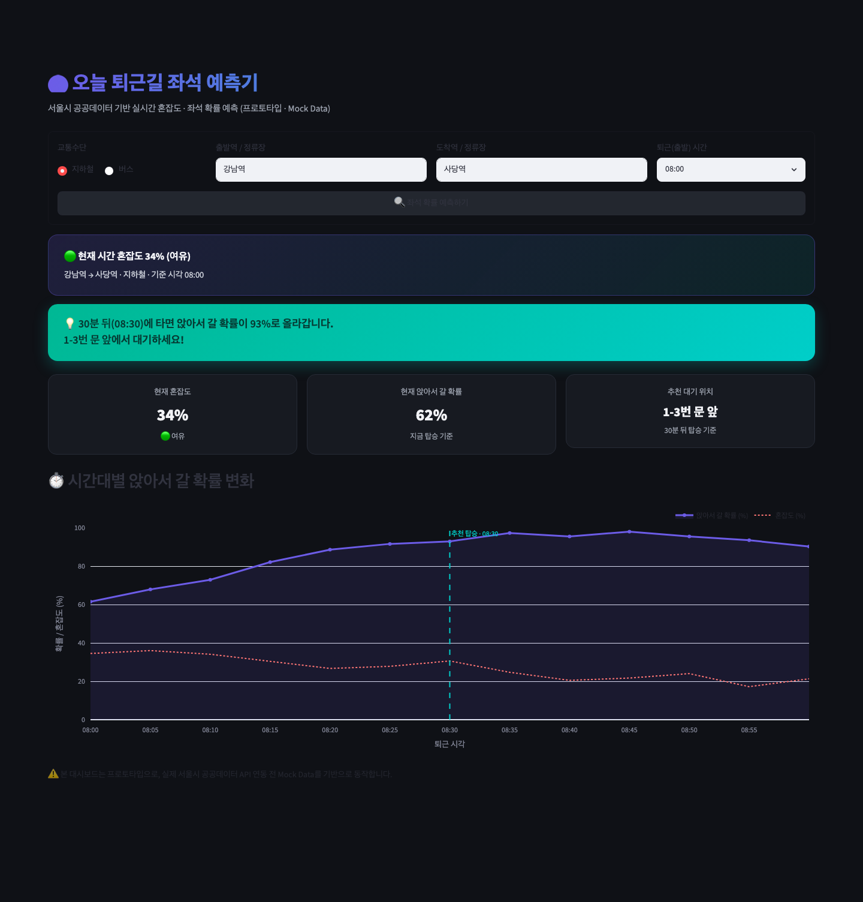
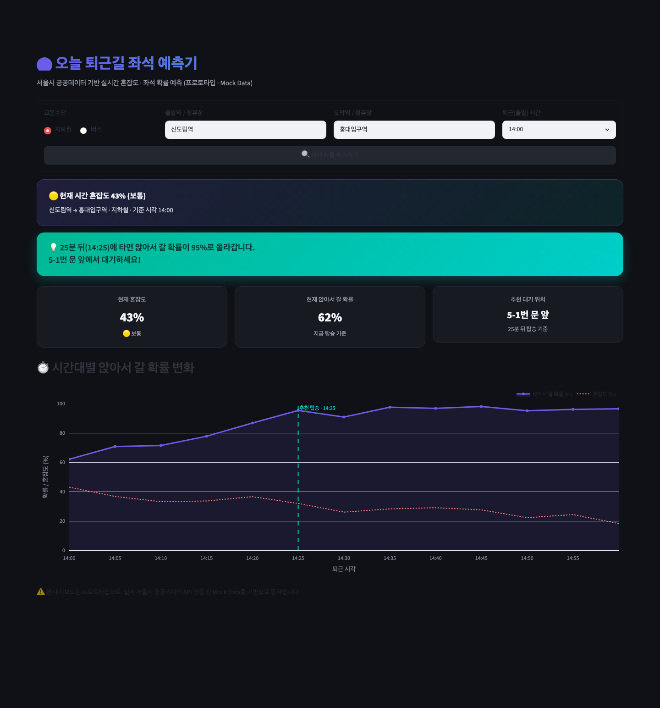
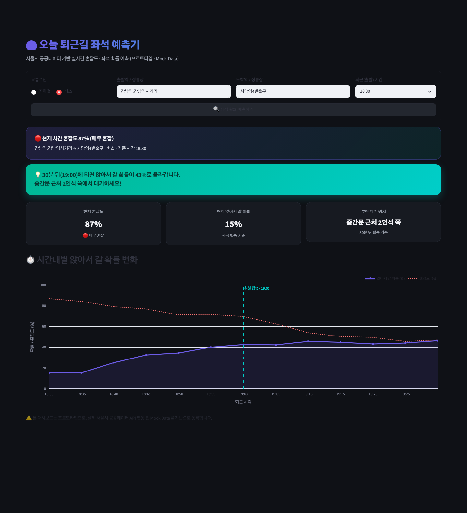
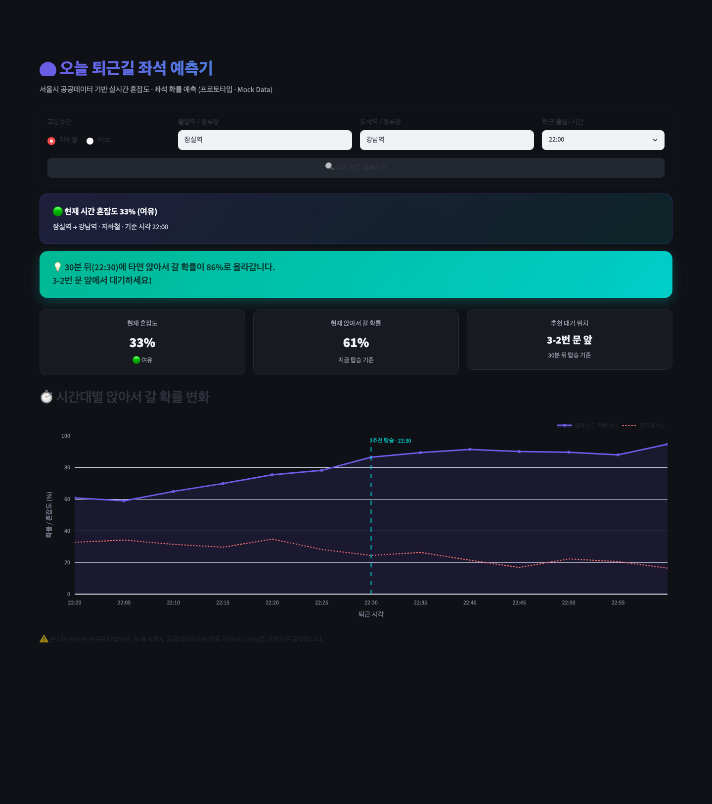

# 🚇 seat-predictor

직장인·대학생을 위한 **"오늘 퇴근/하교길 버스·지하철 좌석 예측기"**

서울시 공공데이터를 기반으로 출발지 → 도착지 구간의 혼잡도와 시간대별 좌석 확률을 예측하고,
"몇 분 뒤에 타면 앉아서 갈 수 있는지" 알려주는 대시보드입니다.
현재는 **Streamlit** 기반 프로토타입(MVP)이며, 지하철 혼잡도는 서울시 공공데이터
(서울교통공사 지하철혼잡도정보 Open API)를 실시간으로 연동하고, 매핑되지 않은
역/버스 데이터는 Mock Data로 대체됩니다.

## 📸 스크린샷

|                                                    |                                                    |
| -------------------------------------------------- | -------------------------------------------------- |
| 지하철 · 강남역 → 사당역 · 08:00 (여유) | 지하철 · 신도림역 → 홍대입구역 · 14:00 (보통) |
|  |  |
| 버스 · 강남역.강남역사거리 → 사당역4번출구 · 18:30 (매우 혼잡) | 지하철 · 잠실역 → 강남역 · 22:00 (여유) |
|  |  |

## 🚀 실행 방법

### 1. 가상환경 생성 및 활성화

```bash
python3 -m venv .venv

# macOS / Linux
source .venv/bin/activate

# Windows
.venv\Scripts\activate
```

### 2. 라이브러리 설치

```bash
pip install -r requirements.txt
```

### 3. (선택) 서울시 공공데이터 인증키 설정

지하철 혼잡도를 실데이터로 보려면 인증키가 필요합니다. 없어도 앱은 정상 동작하며,
이 경우 해당 역은 Mock Data로 표시됩니다.

1. https://data.seoul.go.kr 회원가입 후 로그인
2. [인증키 신청](https://data.seoul.go.kr/together/mypage/actkeyMain.do) — 즉시 무료 발급
3. `.streamlit/secrets.toml.example`을 `.streamlit/secrets.toml`로 복사 후 발급받은 키를 입력
   (`secrets.toml`은 `.gitignore`에 등록되어 있어 커밋되지 않습니다)

```bash
cp .streamlit/secrets.toml.example .streamlit/secrets.toml
# .streamlit/secrets.toml을 열어 subway_congestion_key 값을 채워넣으세요
```

### 4. 앱 실행

```bash
streamlit run app.py
```

실행 후 브라우저에서 `http://localhost:8501` 로 접속하면 대시보드를 확인할 수 있습니다.

## 🛠 기술 스택

- [Streamlit](https://streamlit.io/) — 대시보드 UI
- [Pandas](https://pandas.pydata.org/) / [NumPy](https://numpy.org/) — 데이터 처리
- [Plotly](https://plotly.com/python/) — 시간대별 좌석 확률 시각화

## 📊 관련 데이터셋 링크 (서울시 열린데이터광장)

1. 지하철 시간대별 승하차 데이터
   - [서울시 지하철 호선별 역별 시간대별 승하차 인원 정보](https://data.seoul.go.kr/dataList/OA-12914/S/1/datasetView.do)
2. 버스 시간대별 승하차 데이터
   - [서울시 버스노선별 정류장별 시간대별 승하차 인원 정보](https://data.seoul.go.kr/dataList/OA-12912/S/1/datasetView.do)
3. 지하철 혼잡도 데이터 (✅ 연동됨 — `seoul_api.py`, Open API 서비스명 `subwConfusion`)
   - [서울교통공사 지하철 혼잡도 정보](https://data.seoul.go.kr/dataList/OA-12928/S/1/datasetView.do)
